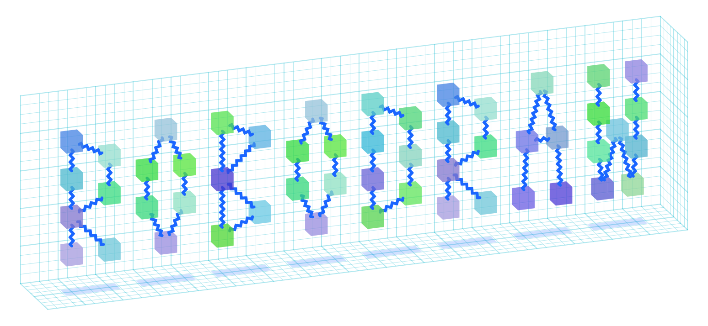
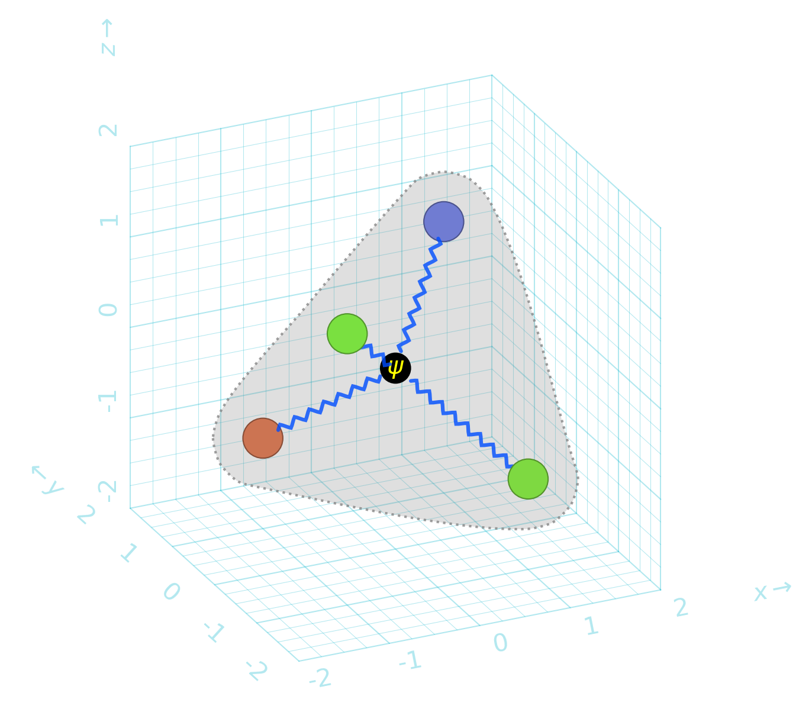

`robodraw` is an ergonomic and programmatic drawing library for python. It is a
wrapper around `matplotlib` that provides a more intuitive way to specifically
create *drawings and diagrams*, including in pseudo-3d. It provides the backend
for the drawing functionality in [`quimb`](https://quimb.readthedocs.io) and
[`cotengra`](https://cotengra.readthedocs.io).

Some useful features include:

- no boilerplate to get a simple drawing.
- plot limits automatially expand to fit all drawn elements.
- style presets: reuse style across elements.
- diagram primitives like `zigzag`, `curve` (draw a smooth line through an
  arbitrary set of points exactly), and `patch_around` (draw a smooth shape
  highlighting an arbitrary set of points).
- pseudo-3d drawing, with automatic perspective and occlusion handling.
- squared paper grid to help you with placement.
- output or use existing matplotlib figure and axis.
- basic colors tools
- ... and more!

A quick example:

```python
import robodraw

d = robodraw.Drawing(
    presets={
        "node": {"radius": 0.2, "linewidth": 0.5},
        "edge": {"color": (0, 0.3, 1, .8), "width": 0.04, "shorten": 0.2}
    },
    projection=(25, 25),
)

center = (0, 0, 0)
corners = [(1, 1, 1), (1, -1, -1), (-1, 1, -1), (-1, -1, 1)]

# nodes
for c in corners:
    color = robodraw.hash_to_color(str(c))
    d.circle(c, preset='node', color=color)

# center
d.circle(center, preset='node', radius=0.15, color="black")
d.text(center, "$\\psi$", color="yellow")

# edges to center
for c in corners:
    d.zigzag(c, center, preset="edge")

d.patch_around(corners, radius=0.5)
d.grid3d()
```


